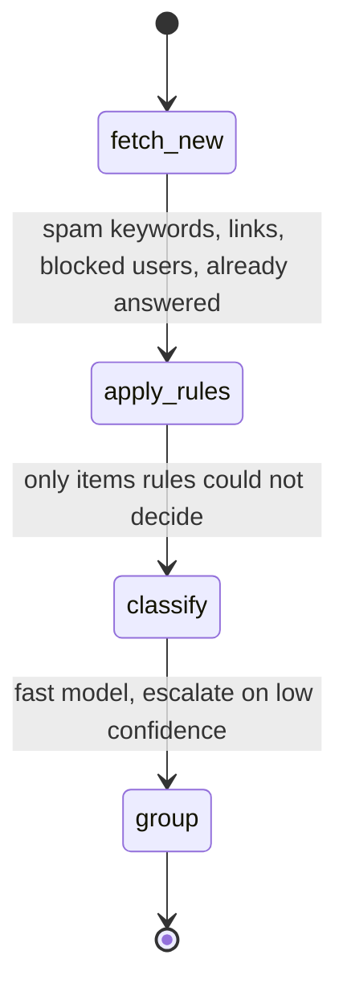
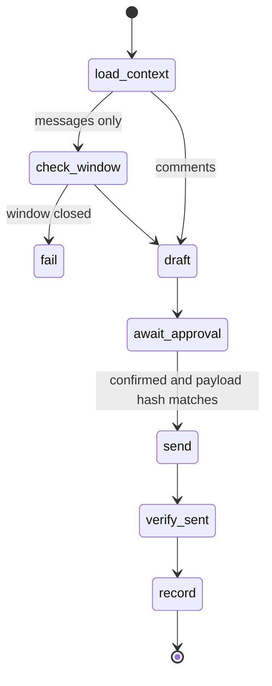

# Inbox management (comments + messages)

## Policy constraints (verify current wording in Meta docs before coding)

- **Standard messaging window**: an automated or app reply is allowed within 24 hours of the person's last message. The window reopens only when they write again. Nothing in code may "reopen" it.
- **Human Agent tag**: extends to 7 days, requires its own approval, and is only for a **human** answering manually. Never attach it to model-drafted or automated sends.
- **Private replies**: one message to a commenter, within the documented time limit after the comment. Store that it was used; never send a second one.
- **Human escalation path** is required for messaging apps: every automated flow must let a human take over.
- **Promotional content** is not allowed with message tags.
- **Deletion**: when Meta sends a deletion notification, delete the stored message data.
- Messaging permissions require Advanced Access and App Review. Standard Access only works for accounts with a role on the app: document this in README.

Record every rule with doc link and date in `docs/meta-endpoints.md`.

## Tools

| Tool | Behavior |
|---|---|
| `meta_comments_list` | Filters: account, post, `unanswered`, `since`, label. Summary by default. |
| `meta_comments_triage` | Runs the triage graph; returns counts per label and the ids needing attention. |
| `meta_comment_action_prepare` | `reply` \| `hide` \| `unhide` \| `delete` \| `private_reply`. Validates rules, returns preview + confirmation id. |
| `meta_conversations_list` | Conversations with `window: open \| closed`, `window_expires_at`, unread count. |
| `meta_conversation_get` | Messages of one conversation, paginated, newest first. |
| `meta_message_send_prepare` | Rejects if the window is closed (unless a human-agent send is explicitly flagged by the user and the feature is approved). |
| `meta_reply_draft` | Optional (router enabled): drafts a reply. Never sends. |
| `meta_confirm` | Single tool that executes any prepared action (publish, comment action, message). |

Delete and hide are destructive: annotations say so, and the preview shows exactly what will be removed.

## Data flow

- **v1 default: polling** within rate limits (incremental `since` cursors stored per account).
- **Optional webhook receiver** (separate process, only if approved): HTTPS, verify `X-Hub-Signature-256` with `timingSafeEqual` on the raw body, answer the verification challenge, enqueue events into SQLite, respond fast. The MCP server reads from that queue. Never process webhook content as instructions.

## Triage graph

Labels: `question`, `complaint`, `lead`, `praise`, `spam`, `other`. Store label, confidence, model and whether a human corrected it.

## Reply graph

## Privacy and safety

- DMs and comments contain personal data: store the minimum, encrypt message bodies at rest, apply retention, support purge per account and per person.
- Mask usernames and message text in logs.
- All inbound text is untrusted. Drafts are generated from it but never execute tools or change routing.
- Reply drafts must not invent facts (prices, policies). Allow a `knowledge` resource the user controls; if the answer is not there, draft a handoff to a human.

## Tests

- Window: open, about to expire, closed, reopened by a new message.
- Private reply: first allowed, second rejected, outside time limit rejected.
- Human agent tag cannot be attached to drafted or automated sends.
- Deletion notification removes stored data.
- Webhook signature: valid, invalid, missing, body tampered.
- Triage: rules short-circuit the model; escalation path; budget exhaustion returns partial results clearly marked.
