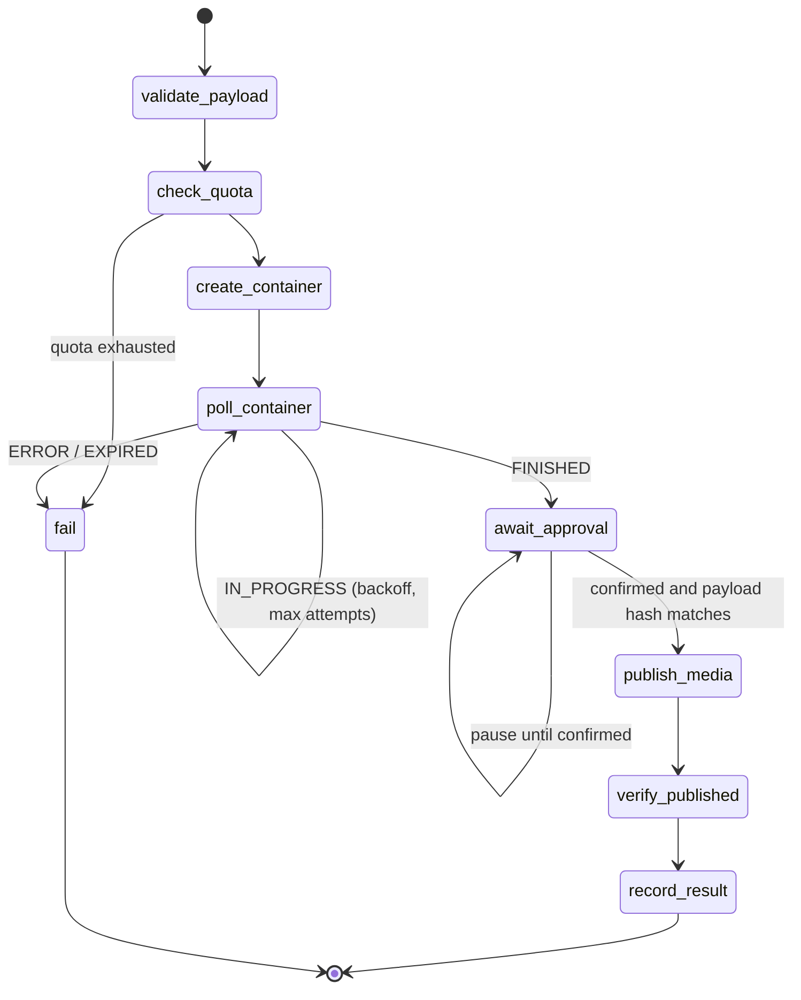
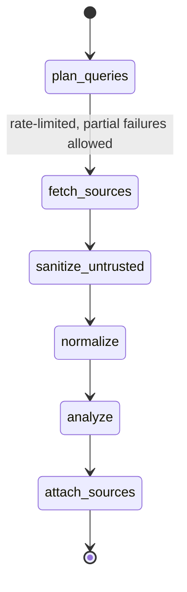

# Workflow graphs

## When to use a graph

| Use a graph | Use a plain function |
|---|---|
| Several steps with side effects (create container → publish) | Single read (get insights) |
| Polling or retries across steps | Pure transformation |
| Human approval pauses the flow | Local-only CRUD |
| Must survive a crash without duplicates | |

## Engine

Use the tiny engine in `references/graph-engine.ts` (tested in `graph-engine.test.ts`). Do not add a graph library unless an ADR proves the engine is insufficient.

Contract:
- A node is `async (state) => { state, next, pause? }`. Nodes never mutate input state.
- The checkpoint is saved **before** each node runs, so a crash resumes at that node.
- `pause: true` stops the run (e.g. waiting for approval). Calling `runGraph` again with the same `runId` resumes.
- `maxSteps` guards against loops. Unknown nodes fail fast.
- Checkpoints persist in SQLite (`workflow_runs` table). State must be JSON-serializable and must **never** contain tokens.

## Node rules

1. One responsibility per node. Name nodes with verbs: `check_quota`, `create_container`.
2. Nodes with side effects are **idempotent**: before acting, check whether the effect already happened (stored container id, stored post id, idempotency key).
3. Decisions live in edges (`next`), not hidden inside services.
4. Each side-effect node is followed by a **verify** node that reads back from Meta. The graph is not done until the effect is verified.
5. Errors: transient → the node returns `next` to itself with an incremented `attempt` and a backoff delay; permanent → `next: "fail"` with a domain error in state.

## Publish graph (Instagram)

Facebook Pages use the same shape without the container steps.

## Research graph

`sanitize_untrusted` strips control characters, truncates fields and wraps third-party text as data. Every claim in the output keeps a reference to the post/account id it came from.

## Inbox graphs

The comment triage graph and the reply graph are defined in the `inbox-management` skill. They follow the same rules: rules in code before models, approval before send, verify after send.

## Required tests per graph

- Happy path end to end.
- Each failure edge (quota, container error, permanent API error).
- Pause → resume.
- Crash in each side-effect node → resume → **exactly one** side effect.
- `maxSteps` exceeded.

Document every graph as Mermaid in `docs/architecture.md`, kept in sync with the code.
